# API Gateway Architecture - Phase 2.2

## 🏗️ Overview

The API Gateway serves as the **single entry point** for all client requests to backend microservices, implementing centralized security controls, routing, and observability.

**Architecture Pattern**: Backend for Frontend (BFF) + API Gateway

## 📊 High-Level Architecture


## 🔄 Request Flow

### Normal Request Flow


### Authentication Flow


## 🛡️ Security Controls

### Layer 1: Network Security

```mermaid
graph LR
    Internet((Internet))
    Gateway[API Gateway<br/>:8080 exposed]
    Auth[Auth Service<br/>:8000 exposed]
    User[User Service<br/>:8002 exposed]
    
    Internet -->|✅ Allowed| Gateway
    Internet -.->|⚠️ VULNERABLE<br/>Direct Access| Auth
    Internet -.->|⚠️ VULNERABLE<br/>Direct Access| User
    
    style Gateway fill:#4CAF50,color:#fff
    style Auth fill:#FF5722,color:#fff
    style User fill:#FF5722,color:#fff
```



**Current State**:
- ❌ Backend services exposed on public ports (8000, 8002)
- ⚠️ Allows bypassing Gateway security controls

**Recommended** (Future):
- ✅ Only Gateway exposed externally
- ✅ Backend services on internal network only
- ✅ mTLS for service-to-service communication

### Layer 2: Gateway Middleware Stack

Requests pass through middleware in this order:

```
1. LoggingMiddleware          → Request logging with timing
   ↓
2. SecurityHeadersMiddleware  → Add security headers
   ↓
3. RateLimitMiddleware        → Token bucket (60 req/min, burst 10)
   ↓
4. RequestValidationMiddleware → WAF checks
   ↓
5. CORSMiddleware             → CORS headers (if enabled)
   ↓
6. Route Handler              → JWT validation (if protected)
   ↓
7. Backend Proxy              → Forward to backend service
```

### Layer 3: JWT Validation

```python
# Automatic on protected endpoints
@app.get("/protected")
async def protected_endpoint(current_user: Dict = Depends(get_current_user)):
    # JWT verified automatically
    # current_user contains: {sub, type, exp, iat}
    return {"user": current_user["sub"]}
```

**Validation Steps**:
1. Extract token from `Authorization: Bearer <token>` header
2. Verify JWT signature using shared secret
3. Check token type (`access` vs `refresh`)
4. Validate expiration time
5. Reject if any check fails (401 Unauthorized)

### Layer 4: Rate Limiting

**Algorithm**: Token Bucket

```
Capacity: 60 tokens (requests per minute)
Burst: 10 tokens (simultaneous requests)
Refill Rate: 1 token per second
```

**Behavior**:
- First 10 requests: Instant (burst)
- Requests 11-60: Throttled (1/sec)
- Request 61+: Blocked (429 Too Many Requests)

**Response Headers**:
```http
X-RateLimit-Limit: 60
X-RateLimit-Remaining: 45
X-RateLimit-Reset: 1699564800
```

### Layer 5: WAF (Web Application Firewall)

**Protection Against**:

| Attack Type | Pattern | Action |
|-------------|---------|--------|
| SQL Injection | `' OR '1'='1`, `UNION SELECT` | Block (400) |
| XSS | `<script>`, `javascript:` | Block (400) |
| Path Traversal | `../`, `..\\` | Block (400) |
| Command Injection | `; rm -rf`, `\| nc` | Block (400) |
| Oversized Request | Body > 10MB | Block (413) |

**Example**:
```bash
# Blocked by WAF
curl "http://localhost:8080/api/users/search?q=<script>alert('xss')</script>"
# Response: 400 Bad Request - Request contains suspicious pattern
```

## 📡 API Endpoints

### Public Endpoints (No Authentication)

| Method | Endpoint | Description | Backend |
|--------|----------|-------------|---------|
| GET | `/` | Gateway info | Gateway |
| GET | `/health` | Health check | Gateway |
| GET | `/metrics` | Prometheus metrics | Gateway |
| POST | `/auth/login` | User login | Auth Service |
| POST | `/auth/mfa/verify` | MFA verification | Auth Service |

### Protected Endpoints (JWT Required)

| Method | Endpoint | Description | Backend | Vulnerability |
|--------|----------|-------------|---------|---------------|
| GET | `/protected` | Demo protected endpoint | Gateway | - |
| POST | `/auth/token/refresh` | Refresh access token | Auth Service | - |
| GET | `/api/users/profile/{id}` | Get user profile | User Service | ⚠️ IDOR |
| GET | `/api/users/settings` | Get user settings | User Service | ⚠️ No Auth Check |

## 🚨 Intentional Vulnerabilities

### 1. Direct Service Access (Gateway Bypass)

**Vulnerability**: Backend services exposed on public ports

```bash
# Through Gateway (secured)
curl http://localhost:8080/api/users/profile/1 \
  -H "Authorization: Bearer <token>"
# Requires: JWT, Rate limited, WAF protected

# Direct to service (VULNERABLE)
curl http://localhost:8002/profile/1
# Requires: Nothing! Complete bypass!
```

**Attack Script**: `attacks/direct-access/direct_access_attack.py`

**Remediation**: 
- Remove port exposure in docker-compose.yml
- Implement mTLS
- Use internal Docker network

### 2. IDOR in User Service

**Vulnerability**: No authorization check in `/profile/{user_id}`

```bash
# Login as user1, access user2's profile
curl http://localhost:8080/api/users/profile/2 \
  -H "Authorization: Bearer <user1_token>"
# Returns user2's SSN, credit card, etc.
```

**Attack Script**: `attacks/idor-exploit/idor_attack.py`

**Remediation**:
- Add authorization check: `if authenticated_user != requested_user_id`
- Implement RBAC
- Use indirect references (UUIDs)

### 3. Missing Authentication in Settings

**Vulnerability**: `/settings` endpoint doesn't validate JWT

```bash
# No token required!
curl http://localhost:8080/api/users/settings?user_id=1
# Returns API keys, secrets, etc.
```

**Attack Script**: `attacks/idor-exploit/idor_attack.py`

**Remediation**:
- Add JWT validation
- Implement authorization checks

### 4. Rate Limit Bypass

**Vulnerability**: Rate limit only on Gateway, not on backend

```bash
# Direct access bypasses rate limit
for i in {1..1000}; do
  curl http://localhost:8002/profile/1
done
# All requests succeed!
```

**Attack Script**: `attacks/rate-limit-bypass/rate_limit_bypass.py`

**Remediation**:
- Don't expose backend ports
- Implement distributed rate limiting (Redis)
- Rate limit at service level too

## 📊 Monitoring & Observability

### Metrics Exported

**Gateway Metrics**:
```promql
# Total requests
gateway_requests_total{method, path, status_code}

# Request duration
gateway_request_duration_seconds{method, path}

# JWT validation
gateway_jwt_validation_total{result}
gateway_jwt_validation_failures_total{reason}

# Security controls
gateway_rate_limit_blocks_total
gateway_waf_blocks_total{attack_type}

# Backend proxy
gateway_backend_requests_total{backend, method, status_code}
gateway_backend_request_duration_seconds{backend, method}
gateway_backend_errors_total{backend, error_type}
```

**User Service Metrics**:
```promql
# Vulnerability tracking
user_service_idor_attempts_total{authenticated_user, target_user, result}
user_service_direct_access_total{endpoint, source_ip}
user_service_unauthorized_settings_access_total{source_ip}

# General metrics
user_service_requests_total{method, endpoint, status_code}
user_service_request_duration_seconds{method, endpoint}
```

### Grafana Dashboards

1. **Auth Security Dashboard** (`monitoring/grafana/dashboards/auth-security.json`)
   - Login success/failure rates
   - MFA verification metrics
   - Failed authentication attempts
   - JWT validation errors

2. **Attack Visibility Dashboard** (`monitoring/grafana/dashboards/devsecops-attack-visibility.json`)
   - IDOR attempts
   - Direct access bypasses
   - Rate limit violations
   - WAF blocks

### Alerts (Prometheus)

```yaml
# Example: High IDOR attempt rate
- alert: HighIDORAttempts
  expr: rate(user_service_idor_attempts_total[5m]) > 5
  annotations:
    summary: "High IDOR exploitation attempts detected"
```

## 🔧 Configuration

### Environment Variables

**Gateway**:
```env
# Service URLs
AUTH_SERVICE_URL=http://login-api:8000
USER_SERVICE_URL=http://user-service:8000

# JWT Configuration
SECRET_KEY=dev-secret-key-change-in-production
JWT_ALGORITHM=HS256

# Security
ENABLE_CORS=true
ALLOWED_ORIGINS=["*"]

# Rate Limiting
RATE_LIMIT_ENABLED=true
RATE_LIMIT_REQUESTS_PER_MINUTE=60
RATE_LIMIT_BURST_SIZE=10

# WAF
WAF_ENABLED=true
WAF_MAX_BODY_SIZE=10485760  # 10MB

# Logging
LOG_LEVEL=INFO
DEBUG=false
```

### Docker Compose

```yaml
api-gateway:
  build: ./vulnerable-services/api-gateway
  ports:
    - "8080:8080"
  environment:
    - AUTH_SERVICE_URL=http://login-api:8000
    - USER_SERVICE_URL=http://user-service:8000
  networks:
    - devsecops-lab
  depends_on:
    - login-api
    - user-service
```

## 🧪 Testing

### Health Check

```bash
curl http://localhost:8080/health
```

Expected:
```json
{
  "status": "healthy",
  "service": "API Gateway",
  "version": "0.1.0",
  "backends": {
    "auth-service": {"status": "healthy"},
    "user-service": {"status": "healthy"}
  }
}
```

### JWT Protected Endpoint

```bash
# Get token
TOKEN=$(curl -s -X POST http://localhost:8080/auth/login ...)

# Access protected endpoint
curl http://localhost:8080/protected \
  -H "Authorization: Bearer $TOKEN"
```

### Rate Limiting

```bash
# Burst test
for i in {1..15}; do
  curl http://localhost:8080/
done
# First 10-12 succeed, rest get 429
```

### WAF

```bash
# Should be blocked
curl "http://localhost:8080/search?q=<script>alert('xss')</script>"
# Response: 400 Bad Request
```

## 📚 Further Reading

- [API Gateway Pattern](https://microservices.io/patterns/apigateway.html)
- [JWT Best Practices](https://tools.ietf.org/html/rfc8725)
- [OWASP API Security Top 10](https://owasp.org/www-project-api-security/)
- [Rate Limiting Patterns](https://cloud.google.com/architecture/rate-limiting-strategies-techniques)

## 🚨 Monitoring & Alerts

The API Gateway exposes detailed metrics and triggers security alerts for anomaly detection.

### Metrics Exposed

**Gateway Metrics** (Port 8080):

```promql
# Request metrics
gateway_requests_total{method, path, status_code}
gateway_request_duration_seconds{method, path}

# Security metrics
gateway_jwt_validation_total{result}
gateway_jwt_validation_failures_total{reason}
gateway_rate_limit_blocks_total
gateway_waf_blocks_total{attack_type}

# Backend metrics
gateway_backend_requests_total{backend_name, status}
gateway_backend_request_duration_seconds{backend_name}
gateway_backend_errors_total{backend_name, error_type}
```

**Access**:
```bash
curl http://localhost:8080/metrics
```

### Prometheus Alerts

**Critical Alerts** (require immediate action):

| Alert | Condition | Threshold | Severity |
|-------|-----------|-----------|----------|
| `DirectServiceAccessDetected` | Backend accessed without Gateway | >10 in 5m | 🔴 Critical |
| `IDORExploitationAttempt` | Unauthorized profile access | >5 in 5m | 🔴 Critical |
| `UnauthorizedSettingsAccess` | Auth bypass on `/settings` | >10 in 5m | 🔴 Critical |
| `WAFSQLInjectionAttempt` | SQL injection detected | >5 in 5m | 🔴 Critical |
| `APIGatewayDown` | Gateway unreachable | >1m | 🔴 Critical |

**Warning Alerts** (degraded performance/potential attack):

| Alert | Condition | Threshold | Severity |
|-------|-----------|-----------|----------|
| `GatewayRateLimitExceeded` | High rate of blocks | >20 in 5m | 🟡 Warning |
| `GatewayRateLimitBypass` | Traffic bypassing Gateway | Ratio >1.5x | 🟡 Warning |
| `WAFBlockSpike` | Active attack (SQLi/XSS) | >10 in 5m | 🟡 Warning |
| `GatewayJWTValidationFailureSpike` | Token tampering | >15 in 5m | 🟡 Warning |
| `GatewayHighLatency` | Slow responses | p95 >2s | 🟡 Warning |

**Alert Configuration**: `monitoring/prometheus/alert_rules.yml`

### Grafana Dashboards

**Service Mesh Security Dashboard**:
- Real-time request rates (Gateway vs Backend)
- IDOR exploitation attempts (last 5m gauge)
- Direct service access bypasses (last 5m gauge)
- JWT validation success/failure breakdown
- Rate limiting & WAF block visualization
- Service health status (UP/DOWN indicators)

**Access**: http://localhost:3000/d/devsecops-service-mesh

**Attack Visibility Dashboard**:
- Detailed IDOR attack mapping (user → target)
- Source IP tracking for direct access
- WAF blocks by attack type (SQLi, XSS, Path Traversal)
- Backend error rates

**Access**: http://localhost:3000/d/devsecops-attack-visibility

### Alert Response Playbook

**When `DirectServiceAccessDetected` fires**:

1. **Immediate**:
   - Check `user_service_direct_access_total` metric
   - Identify source IP: `source_ip` label
   - Review logs: `docker-compose logs user-service | grep "DIRECT ACCESS"`

2. **Investigation**:
   ```bash
   # Query attack details
   curl 'http://localhost:9090/api/v1/query?query=user_service_direct_access_total'
   
   # Check recent attacks
   cd attacks/direct-access
   cat results/*.json
   ```

3. **Remediation**:
   - Remove port exposure in `docker-compose.yml`
   - Implement mTLS (see `infrastructure/certs/MTLS_IMPLEMENTATION_PLAN.md`)
   - Add network policies to restrict backend access

**When `IDORExploitationAttempt` fires**:

1. **Immediate**:
   - Check `user_service_idor_attempts_total{result="success"}` metric
   - Identify attacker: `authenticated_user` label
   - Identify victims: `target_user` label

2. **Investigation**:
   ```bash
   # Get attack details
   curl 'http://localhost:9090/api/v1/query?query=user_service_idor_attempts_total'
   
   # Review User Service logs
   docker-compose logs user-service | grep "IDOR"
   ```

3. **Remediation**:
   - Add authorization check in `/profile/{user_id}` endpoint:
     ```python
     if authenticated_user != user_id:
         raise HTTPException(status_code=403, detail="Forbidden")
     ```
   - Revoke attacker's JWT tokens
   - Notify affected users (GDPR compliance)

**When `GatewayHighLatency` fires**:

1. **Check backend health**:
   ```bash
   curl http://localhost:8080/health
   curl http://localhost:9090/targets
   ```

2. **Identify slow backend**:
   ```promql
   histogram_quantile(0.95, 
     rate(gateway_backend_request_duration_seconds_bucket[5m])
   ) by (backend_name)
   ```

3. **Scale or investigate**:
   - Scale backend: `docker-compose up -d --scale user-service=3`
   - Check backend logs: `docker-compose logs <service>`
   - Review resource usage: `docker stats`

---

## 🔮 Future Enhancements

1. **mTLS Implementation**
   - Certificate-based authentication
   - See: `infrastructure/certs/MTLS_IMPLEMENTATION_PLAN.md`

2. **Advanced Rate Limiting**
   - Redis-based distributed limiting
   - Per-user/per-token limits
   - Dynamic limits based on behavior

3. **Enhanced WAF**
   - Machine learning-based detection
   - Custom rule engine
   - GeoIP blocking

4. **Service Mesh**
   - Istio/Linkerd integration
   - Automatic mTLS
   - Advanced traffic management

---

**Author**: DevSecOps Hacking Lab  
**Last Updated**: 2025-11-10  
**Phase**: 2.2 - API Gateway & Microservices

